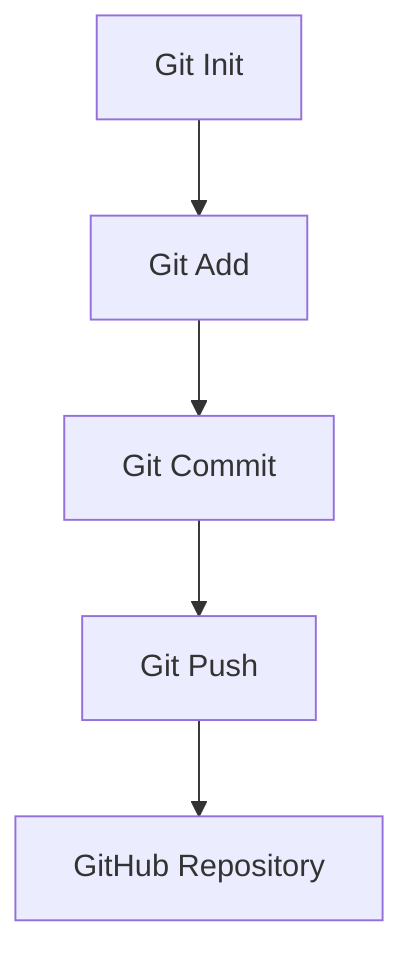
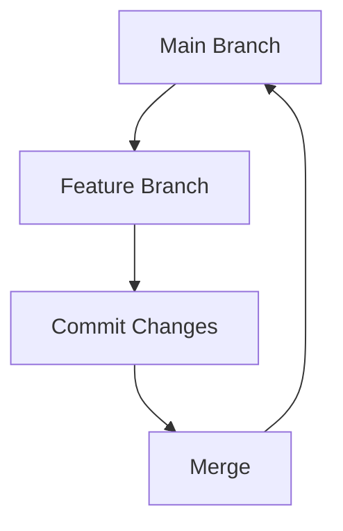

# 🌟 **Repositori Git dan GitHub**  
**📂 Belajar Git dan GitHub dari Dasar hingga Mahir**  

<p align="center">  
    
    
</p>  

<p align="center">  
      
      
      
</p>  

## 📖 **Tentang Repositori**  
Repositori ini adalah dokumentasi perjalanan saya mempelajari **Git dan GitHub**. Mulai dari pengelolaan **version control**, kolaborasi dengan tim, hingga implementasi best practices!  

🎯 **Kenapa penting?**  
- Menghindari konflik saat bekerja dalam tim.  
- Mengelola versi kode dengan aman.  
- Mengembangkan portofolio pengembangan software Anda.  

## 🎯 **Topik yang Dipelajari**  

| 📚 **Topik**                   | 🎯 **Deskripsi**                                         | 🔧 **Status**   |  
|--------------------------------|---------------------------------------------------------|-----------------|  
| 🚀 Getting Started             | Cara instalasi Git dan membuat repositori lokal.         | ✅ Selesai      |  
| 🌐 Bekerja dengan GitHub       | Membuat dan mengelola repositori GitHub.                 | ✅ Selesai      |  
| 🌿 Branching dan Merging       | Membuat branch, merge, dan menangani konflik.            | 🛠️ Dalam Proses|  
| 🤝 Kolaborasi Tim              | Pull requests, forks, dan cloning repositori tim.        | 🛠️ Dalam Proses|  

## 🛠️ **Fitur Visual Git**  

### **🚀 Alur Dasar Git**  


### **🌿 Branching & Merging**  


## 💡 **Sumber Belajar**  
Saya belajar Git dan GitHub melalui:  
- [🎥 **Web Programming UNPAS**](https://www.youtube.com/c/WebProgrammingUNPAS)   
- [🎥 **Micola Arighi**](https://www.youtube.com/@MicolaArighi)   

Terima kasih kepada para pengajar yang telah berbagi ilmunya! 🙌  

## 💡 **Tips dan Trik**  
1. **Cheat Sheet Git**:  
   📄 [Git Cheat Sheet (PDF)](https://education.github.com/git-cheat-sheet-education.pdf)  

2. **Git Aliases**: Buat perintah Git lebih singkat dengan alias, contohnya:  
   ```bash
   git config --global alias.st status  
   git config --global alias.co checkout  
   ```

## 🤝 **Kontribusi**  
Saya terbuka untuk saran, ide, dan kontribusi! Anda dapat:  
1. Membuat *issue* di repositori ini.  
2. Melakukan *pull request* untuk menambahkan materi baru.  

## 📬 **Hubungi Saya**  
- **Website**: [mkaspulanwar.my.id](https://mkaspulanwar.my.id)  
- **GitHub**: [@username-anda](https://github.com/mkasplanwar)  

### ✨ **Selamat Belajar!**  
*“Menjadi master dimulai dengan langkah kecil pertama. Mari kita pelajari Git bersama!”* 💪  

---
